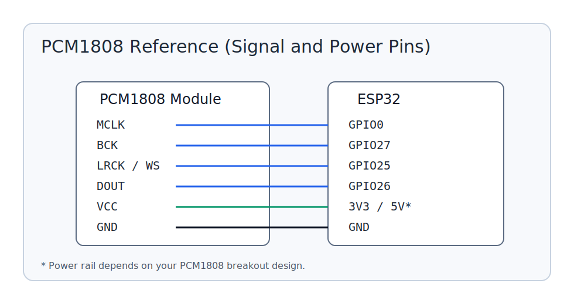

# ESP-NOW Audio Source (ESP32 + PCM1808)

This project captures stereo audio from a PCM1808 ADC over I2S, encodes it with IMA ADPCM, and broadcasts frames over ESP-NOW with low and stable latency.

The code that is currently built is `main/main_adpcm.c`.

## Target and Required Environment

- MCU target: **ESP32**
- ESP-IDF version: **5.5.2**
- Transport: **ESP-NOW broadcast**
- Audio format on air: **IMA ADPCM**

## Hardware

### Source board
- ESP32 dev board
- PCM1808 ADC module

### PCM1808 reference image



## Wiring (ESP32 -> PCM1808)

Configured in `main/main_adpcm.c`:

- `GPIO0`  -> `MCLK`
- `GPIO27` -> `BCK`
- `GPIO25` -> `LRCK/WS`
- `GPIO26` -> `DOUT` (ADC data out)
- `GND`    -> `GND`
- `3V3/5V` -> module power (follow your PCM1808 module spec)

## Runtime Parameters (current code)

- Wi-Fi channel: `11`
- TX power: `15 dBm` (`WIFI_TX_POWER_QDBM=60`)
- Payload: `96` ADPCM bytes per packet
- Effective frame size: `96` stereo sample-pairs
- Sample rate: `48 kHz`, stereo

## Build and Flash (ESP-IDF 5.5.2)

```bash
idf.py --version
```

Confirm this shows `ESP-IDF v5.5.2`.

```bash
idf.py set-target esp32
idf.py build
idf.py -p COMx flash monitor
```

Replace `COMx` with your board port.

## Notes on Logging

The serial logs are intentionally short and operational:

- startup summary
- ESP-NOW init state
- transmit stats (`ok/fail/rate/pps`)

This keeps monitor output useful while tuning latency and link quality.

## Pairing with Sink

Use this together with the sink repo:

- Source repo (this project): captures + transmits
- Sink repo: receives + decodes + outputs I2S to PCM5102A

Both sides must use the same Wi-Fi channel and audio frame assumptions.
